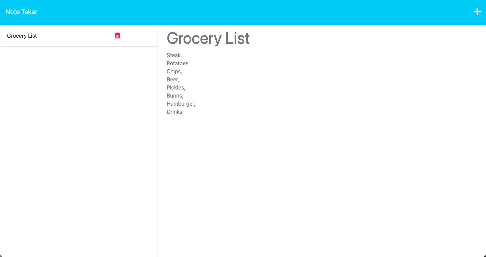

# NoteTaker

## Description

A note taking application that uses an Express server.

## Badge

## Table of Contents

- [Installation](#installation)
- [Usage](#usage)
- [Screenshot](#screenshot)
- [Heroku Link](#heroku-link)
- [License](#license)
- [Contributing](#contributing)
- [Tests](#tests)
- [Questions](#questions)
- [Badges](#badges)
- [Sources](#sources)

## Installation

run npm start

## Usage

You can use the NoteTaker application to create and store notes for future use.

## Screenshot

## Heroku Link

[Link to working example](https://note-application.herokuapp.com/)

## License

[GPL](https://api.github.com/licenses/gpl-3.0)

## Contributing

To contribute, please fork the project and create a feature branch.

## Tests

This project has no test instructions

## Questions

Github Username: xclusive36  
Github Profile: [Github Profile](https://github.com/xclusive36/)  
Any additional questions, please reach out to me by email:  
Email: [Email](mailto:xclusive36@gmail.com)

## Sources

- [Express](https://expressjs.com/)  
  Fast, unopinionated, minimalist web framework for Node.js
